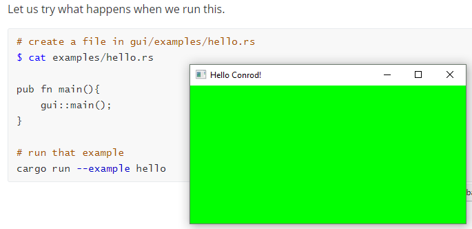
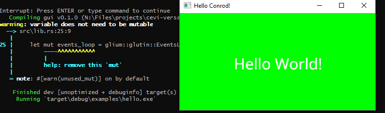
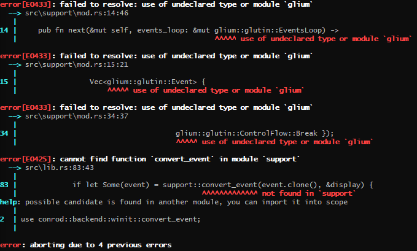

## How To Use [Conrod]( https://github.com/PistonDevelopers/conrod )

Writing a GUI in rust. A walkthrough because I was unable to even find the official guide for a very long time. This is not well-written. It's supposed to be easily written and quickly used. No beauty to be found here.

*If you simply want a working `hello-world` and find out the rest by yourself, just grab the files here.*

### Final Files

You can grab the files here:

* [src/support/mod.rs](./src/support/mod.rs)
* [src/lib.rs](src/lib.rs)
* [Cargo.toml](./Cargo.toml)
* [examples/hello.rs](examples/hello.rs)

And then run it with

```cargo run --example hello```

### Run Their Example

I wrote this sloppily while trying to get this to run. If you would like to see why I'm doing what I'm doing or need reference links, read on!

 Latest commit [78438e1](https://github.com/PistonDevelopers/conrod/commit/78438e196ff1499f843c5ba6eb11085e062a7bb7) 23 days ago. Today is 26.11.2019

```bash
git clone https://github.com/PistonDevelopers/conrod.git
cd conrod
cargo build # fails
```
Edit `conrod/Cargo.toml` so that it looks like this:
```bash
$ cat Cargo.toml
[workspace]
members = [
    "conrod_core",
    "conrod_derive",
    "backends/conrod_example_shared",
    "backends/conrod_winit",
    "backends/conrod_gfx",
    "backends/conrod_glium",
    "backends/conrod_piston",
#    "backends/conrod_vulkano",
]
```
```bash
cargo build # succeeds
cargo run --example all_winit_glium # cool example
cargo run --example hello_world # simple example
```

examples are found in `backends/conrod_glium`.

### Steal Their Example

Their examples are made to be run _within_ their crate. We want to get this to run in our own crate.

```bash
# cd SOMEWHERE
# create a new crate called gui
cargo new --lib gui
```

Have a look at `conrod/backends/conrod_glium/hello_world.rs`. It's written in edition 2015 I think, so some syntax in there is no longer encouraged today. It should still compile though.

Let us start with the first few lines of `hello_world.rs`:

```rust
//! A simple example that demonstrates using conrod within a basic `winit` window loop, using
//! `glium` to render the `conrod_core::render::Primitives` to screen.

#[macro_use] extern crate conrod_core;
extern crate conrod_glium;
#[macro_use] extern crate conrod_winit;
extern crate find_folder;
extern crate glium;

mod support;

use conrod_core::{widget, Colorable, Positionable, Widget};
use glium::Surface;

const WIDTH: u32 = 400;
const HEIGHT: u32 = 200;
```

I copied them over to my own crate in `gui/src/lib.rs` and try to build that.

```bash
cargo build
# fails because it can't find crate "conrod_core"
```

The `extern crate` is no longer needed in the 2018 edition though:

>  Now, to add a new crate to your project, you can add it to your `Cargo.toml`, and then there is no step two. If you're not using Cargo, you already had to pass `--extern` flags to give `rustc` the location of external crates, so you'd just keep doing what you were doing there as well. 
>
> [Source]( https://doc.rust-lang.org/edition-guide/rust-2018/module-system/path-clarity.html#an-exception )

So let us depend on conrod by adding the line to `Cargo.toml`:

```bash
$ cat Cargo.toml
[package]
name = "gui"
version = "0.1.0"
authors = ["eric <eric@mink.li>"]
edition = "2018"

# See more keys and their definitions at https://doc.rust-lang.org/cargo/reference/manifest.html

[dependencies]
conrod = { version = "0.61", features = ["winit", "glium"] }
```

That does not help finding `conrod_core`. Luckily they have a hidden [third chapter]( https://docs.piston.rs/conrod/src/conrod_core/guide/chapter_3.rs.html ) to their guide (from 2017), which is not linked in the README. And it turns out that we need to do quite a few things differently when we are not within the `conrod` crate. So let's follow that guide instead.

> For simplicity, I'm
> specifying the backend in `cargo.toml` because we then won't have to think
> about it in the code itself.

> I'm using the glium backend. [Glium](https://github.com/glium/glium) is a
> cross-platform, safe wrapper for OpenGL, written in Rust. It is listed as not-
> maintained on Github, but limited maintenance is being undertaken by the
> developer of Conrod. Glium has a very good, gentle
> [introduction]( https://github.com/glium/glium/tree/master/book ) to OpenGL - enough to
> convince me that I really want Conrod to do the work for me!

After following the guide up to line 196, we have a file that actually builds with our one dependency in `Cargo.toml` above.

```rust
/// gui/src/lib.rs
/// A Hello World based and annotated with help of https://docs.piston.rs/conrod/src/conrod_core/guide/chapter_3.rs.html
use conrod::backend::glium::glium;
/*
 `Surface` is a trait required for glium, specifically for the call to
`target.clear_color` which is coming later.
 */
use glium::Surface;

/*
 The first chunk of boilerplate creates an event loop, which will handle
interaction with the UI, then a window, then a context, then finally links the
event loop, window and context together into a display. The display is the
home for the UI, and is an OpenGL context provided by glium.
*/

const WIDTH: u32 = 400;
const HEIGHT: u32 = 200;
const TITLE: &str = "Hello Conrod!";


pub fn main() {
    // Build the window.
    let mut events_loop = glium::glutin::EventsLoop::new();
    let window = glium::glutin::WindowBuilder::new()
        .with_title(TITLE)
        .with_dimensions((WIDTH, HEIGHT).into());
    let context = glium::glutin::ContextBuilder::new()
        .with_vsync(true)
        .with_multisampling(4);
    let display = glium::Display::new(window, context, &events_loop).unwrap();

    /*
       Now create the UI itself. Conrod has a builder that contains and looks after
       the UI for the user.
       */
    let mut ui = conrod::UiBuilder::new([WIDTH as f64, HEIGHT as f64]).build();

    /*
       Conrod can use graphics. It stores these in a map. The system needs the map,
       even though it doesn't contain anything at this time, so create it:
       */
    let image_map = conrod::image::Map::<glium::texture::Texture2d>::new();

    /*
       Finally, Conrod needs to render its UI. It uses a renderer to do this, so
       create one:
       */
    let mut renderer = conrod::backend::glium::Renderer::new(&display).unwrap();

    'render: loop {
        // Draw the UI if it has changed
        if let Some(primitives) = ui.draw_if_changed() {
            renderer.fill(&display, primitives, &image_map);
            let mut target = display.draw();
            target.clear_color(0.0, 1.0, 0.0, 1.0);
            renderer.draw(&display, &mut target, &image_map).unwrap();
            target.finish().unwrap();
        }
    }
}

```

Let us try what happens when we run this.

```bash
# create a file in gui/examples/hello.rs
$ cat examples/hello.rs

pub fn main(){
    gui::main();
}

# run that example
cargo run --example hello
```

That results in a green window. Closing it with the X does nothing, so kill it again using `CTRL+C` in the terminal.



> Right now, the program really doesn't do much.

> `target = display.draw()` starts drawing on the backbuffer. It returns a
> Frame, which the renderer can draw everything to. The first command to
> `target` is to `clear_color`. This takes fractional red, green and blue values
> between 0.0 and 1.0, and an alpha value, also between 0.0 and 1.0 and fills
> the frame, in this case with bright green. The renderer is then asked to draw
> the rest of the UI (ie nothing) to the frame, and finally, `target`, the
> frame, is told to finish. It stops the drawing, swaps the OpenGL buffers
> (putting the just drawn frame on the screen) and consumes the frame. The frame
> docs are part of glium
> [here](https://docs.rs/glium/0.17.1/glium/struct.Frame.html).
>
> If you've run this program, you'll have seen the single least useful output
> ever - a green block with a white "menu bar" that has nothing in it. Let's add
> at least something to see.

We add two lines within the render loop. See further below for the whole file snippet again.
>
>```ignore
>widget_ids!(struct Ids { text });
>let ids = Ids::new(ui.widget_id_generator());
>```
>
>`widget_ids!` is, as its name suggests, a macro provided by conrod to create
>widget ids. Conrod's primary data structure contains all the widgets, and uses
>their ids to keep track of them. The `widget_ids!` macro just provides a very
>quick and easy way of defining widget names (in this case just `text`) and
>giving them ids.
>
>After defining the widget_ids, `Ids::new` creates the the widget structure.
>
>To instantiate the widgets, insert the following code in the main loop, before
>the rendering statement.
>
>```ignore
>// Do not forget this line
>let ui = &mut ui.set_widgets();
>
>// "Hello World!" in the middle of the screen.
>widget::Text::new("Hello World!")
>.middle_of(ui.window)
>.color(conrod::color::WHITE)
>.font_size(32)
>.set(ids.text, ui);
>```

Trying to compile this gives us some new issues:

* cannot find macro 'widget_ids!'
  => We add a `use conrod::widget_ids;` to the start of our file
* failed to resolve: widget
  => `use conrod::widget;`
* no method named `middle_of`
  => `use conrod::position::Positionable;`
* no method named `color`
  => `use conrod::color::Colorable;`
* no method named `set`
  => `use conrod::widget::Widget;`

I'm not sure what `set_widgets` does. Let's check out the [docs](https://docs.rs/conrod/0.61.1/conrod/struct.Ui.html#method.set_widgets):

> pub fn set_widgets(&mut self) -> UiCell
> 
> A function within which all widgets are instantiated by the user, normally situated within the "update" stage of an event loop.

[UiCell]( https://docs.rs/conrod/0.61.1/conrod/struct.UiCell.html ) is a wrapper that imposes some restrictions on us.

> The name came from its likening to a "jail cell for the Ui"

Now that it compiles again, it still looks the same. Here's the current code of the whole file if you're following along:

```rust
/// A Hello World based and annotated with help of https://docs.piston.rs/conrod/src/conrod_core/guide/chapter_3.rs.html
use conrod::backend::glium::glium;
use conrod::{widget_ids, widget};
use conrod::position::Positionable;
use conrod::color::Colorable;
use conrod::widget::Widget;

/*
 `Surface` is a trait required for glium, specifically for the call to
`target.clear_color` which is coming later.
 */
use glium::Surface;

/*
 The first chunk of boilerplate creates an event loop, which will handle
interaction with the UI, then a window, then a context, then finally links the
event loop, window and context together into a display. The display is the
home for the UI, and is an OpenGL context provided by glium.
*/

const WIDTH: u32 = 400;
const HEIGHT: u32 = 200;
const TITLE: &str = "Hello Conrod!";


pub fn main() {
    // Build the window.
    let mut events_loop = glium::glutin::EventsLoop::new();
    let window = glium::glutin::WindowBuilder::new()
        .with_title(TITLE)
        .with_dimensions((WIDTH, HEIGHT).into());
    let context = glium::glutin::ContextBuilder::new()
        .with_vsync(true)
        .with_multisampling(4);
    let display = glium::Display::new(window, context, &events_loop).unwrap();

    /*
       Now create the UI itself. Conrod has a builder that contains and looks after
       the UI for the user.
       */
    let mut ui = conrod::UiBuilder::new([WIDTH as f64, HEIGHT as f64]).build();

    // Generate the widget identifiers.
    widget_ids!(struct Ids { text });
    let ids = Ids::new(ui.widget_id_generator());

    /*
       Conrod can use graphics. It stores these in a map. The system needs the map,
       even though it doesn't contain anything at this time, so create it:
       */
    let image_map = conrod::image::Map::<glium::texture::Texture2d>::new();

    /*
       Finally, Conrod needs to render its UI. It uses a renderer to do this, so
       create one:
       */
    let mut renderer = conrod::backend::glium::Renderer::new(&display).unwrap();

    'render: loop {
        // Draw the UI if it has changed
        if let Some(primitives) = ui.draw_if_changed() {
            renderer.fill(&display, primitives, &image_map);
            let mut target = display.draw();
            target.clear_color(0.0, 1.0, 0.0, 1.0);
            renderer.draw(&display, &mut target, &image_map).unwrap();
            target.finish().unwrap();
        
        	let ui = &mut ui.set_widgets();

            // Add some Hello World Text
            // "Hello World!" in the middle of the screen.
            widget::Text::new("Hello World!")
                .middle_of(ui.window)
                .color(conrod::color::WHITE)
                .font_size(32)
                .set(ids.text, ui);
        }
    }
}

```

> In the definition of the Ids struct above, only one widget was named: `text`.
> Here, first we instantiate all the widgets, using the `ui.set_widgets()` call.
> Then we write code to create each widget of the application. There is only one
> widget in this application - it's a text widget, showing the text "Hello
> World!". It is defined to be positioned in the middle of the `ui.window`, with
> text color of white, and font size of 32. Finally, the widget is bound to the
> UI, using `set(ids.text, ui)`
> 
> The UI code will now ensure that events are passed back from the UI, linked
> through the id, `ids.text`. A text widget doesn't respond to events, so
> there's nothing more to do right now.
> [Source](https://docs.piston.rs/conrod/src/conrod_core/guide/chapter_3.rs.html)

Now let us load a font. It could be any font, but I'll simply take their `ttf` file [from their assets]( https://github.com/PistonDevelopers/conrod/tree/master/assets/fonts/NotoSans ).

```
let assets = find_folder::Search::KidsThenParents(3, 5)
    .for_folder("assets")
    .unwrap();
let font_path = assets.join("fonts/NotoSans/NotoSans-Regular.ttf");
ui.fonts.insert_from_file(font_path).unwrap();
```

We could also specify the path directly. But I'll do it like the guide and use the crate `find_folder` for this. So update the `Cargo.toml`:

```toml
[package]
name = "gui"
version = "0.1.0"
authors = ["eric <eric@mink.li>"]
edition = "2018"

# See more keys and their definitions at https://doc.rust-lang.org/cargo/reference/manifest.html

[dependencies]
conrod = { version = "0.61", features = ["winit", "glium"] }
find_folder = "0.3.0"
```

Here, I try a fixed path instead, in order to have less magic:

```rust
// http://kenteiblog.hatenablog.com/entry/adventcalendar2018_14_rust_study
// Add a `Font` to the `Ui`'s `font::Map` from file.
        const FONT_PATH: &'static str =
            concat!(env!("CARGO_MANIFEST_DIR"), "/assets/fonts/ipag.ttf");
        ui.fonts.insert_from_file(FONT_PATH).unwrap();
```

And when we run it now, we get this:



### Adding Events

The X is still not working. Let's fix that. 

> The window is not getting all its furniture because its events are not being
> handled. At its most simple, events can be handled by fetching them from the
> `event_loop` and dispatching them accordingly.

Create an empty events Vec before our render loop:

`let mut events = Vec::new();`

Clear it first thing in the render loop. We defined an `event_loop` earlier. Now we're gonna use it within the render loop to get waiting events - or die trying, while busy-waiting:

```rust
    let mut events = Vec::new();

    'render: loop {
        events.clear();

        // Get all the new events since the last frame.
        events_loop.poll_events(|event| { events.push(event); });

        // If there are no new events, wait for one.
        if events.is_empty() {
            events_loop.run_forever(|event| {
                events.push(event);
                glium::glutin::ControlFlow::Break
            });
        }

```

And once we have some events, we need to handle them:

```rust
        // Process the events.
        for event in events.drain(..) {

            // Break from the loop upon `Escape` or closed window.
            match event.clone() {
                glium::glutin::Event::WindowEvent { event, .. } => {
                    match event {
                        glium::glutin::WindowEvent::CloseRequested |
                        glium::glutin::WindowEvent::KeyboardInput {
                            input: glium::glutin::KeyboardInput {
                                virtual_keycode: Some(glium::glutin::VirtualKeyCode::Escape),
                                ..
                            },
                            ..
                        } => break 'render,
                        _ => (),
                    }
                }
                _ => (),
            };

```

In this example, we react on the escape key or the X button pressed by breaking our render loop, effectively closing the window.

Complete example where <kbd>Esc</kbd> works:

```rust
/// A Hello World based and annotated with help of https://docs.piston.rs/conrod/src/conrod_core/guide/chapter_3.rs.html
use conrod::backend::glium::glium;
use conrod::{widget_ids, widget, Positionable, Colorable, Widget};

/*
 `Surface` is a trait required for glium, specifically for the call to
`target.clear_color` which is coming later.
 */
use glium::Surface;

/*
 The first chunk of boilerplate creates an event loop, which will handle
interaction with the UI, then a window, then a context, then finally links the
event loop, window and context together into a display. The display is the
home for the UI, and is an OpenGL context provided by glium.
*/

const WIDTH: u32 = 400;
const HEIGHT: u32 = 200;
const TITLE: &str = "Hello Conrod!";


pub fn main() {
    // Build the window.
    let mut events_loop = glium::glutin::EventsLoop::new();
    let window = glium::glutin::WindowBuilder::new()
        .with_title(TITLE)
        .with_dimensions((WIDTH, HEIGHT).into());
    let context = glium::glutin::ContextBuilder::new()
        .with_vsync(true)
        .with_multisampling(4);
    let display = glium::Display::new(window, context, &events_loop).unwrap();

    /*
       Now create the UI itself. Conrod has a builder that contains and looks after
       the UI for the user.
       */
    let mut ui = conrod::UiBuilder::new([WIDTH as f64, HEIGHT as f64]).build();

    /*
       Boilerplate code to load fonts into the Ui's font::Map
       */
    const FONT_PATH: &'static str =
        concat!(env!("CARGO_MANIFEST_DIR"), "/assets/fonts/NotoSans/NotoSans-Regular.ttf");
    ui.fonts.insert_from_file(FONT_PATH).unwrap();


    // Generate the widget identifiers.
    widget_ids!(struct Ids { text });
    let ids = Ids::new(ui.widget_id_generator());

    /*
       Conrod can use graphics. It stores these in a map. The system needs the map,
       even though it doesn't contain anything at this time, so create it:
       */
    let image_map = conrod::image::Map::<glium::texture::Texture2d>::new();

    /*
       Finally, Conrod needs to render its UI. It uses a renderer to do this, so
       create one:
       */
    let mut renderer = conrod::backend::glium::Renderer::new(&display).unwrap();

    let mut events = Vec::new();

    'render: loop {
        // Get all the new events since the last frame.
        events.clear();
        events_loop.poll_events(|event| { events.push(event); });

        // If there are no new events, wait for one.
        if events.is_empty() {
            events_loop.run_forever(|event| {
                events.push(event);
                glium::glutin::ControlFlow::Break
            });
        }

        // Process the events.
        for event in events.drain(..) {
            // Break from the loop upon `Escape` or closed window.
            match event.clone() {
                glium::glutin::Event::WindowEvent { event, .. } => {
                    match event {
                        glium::glutin::WindowEvent::CloseRequested |
                        glium::glutin::WindowEvent::KeyboardInput {
                            input: glium::glutin::KeyboardInput {
                                virtual_keycode: Some(glium::glutin::VirtualKeyCode::Escape),
                                ..
                            },
                            ..
                        } => { println!("STAHP!"); break 'render },
                        _ => (),
                    }
                }
                _ => (),
            };
        }

        // Draw the UI if it has changed
        if let Some(primitives) = ui.draw_if_changed() {
            renderer.fill(&display, primitives, &image_map);
            let mut target = display.draw();
            target.clear_color(0.0, 1.0, 0.0, 1.0);
            renderer.draw(&display, &mut target, &image_map).unwrap();
            target.finish().unwrap();


            let ui = &mut ui.set_widgets();

            // Add some Hello World Text
            // "Hello World!" in the middle of the screen.
            widget::Text::new("Hello World!")
                .middle_of(ui.window)
                .color(conrod::color::WHITE)
                .font_size(32)
                .set(ids.text, ui);
        }
    }
}
```


If we want our program to react to its own events though, we need to add some more code according to the [guide]( https://github.com/PistonDevelopers/conrod/blob/master/conrod_core/src/guide/chapter_3.rs ). It contains much boilerplate code for the events loop at the end, which e.g. limits the updates to 60 FPS at most. The guide is from 2018 though, whereas the [current hello_world sample]( https://github.com/PistonDevelopers/conrod/blob/master/backends/conrod_glium/examples/hello_world.rs ) is from March 2019 and doesn't seem to include that kind of code.

Has that been internalized?

**NO**. It's hidden in [support.rs](https://github.com/PistonDevelopers/conrod/blob/master/backends/conrod_glium/examples/support/mod.rs)

The following is advised in the guide, and it is applied in [all_winit_glium.rs]( https://github.com/PistonDevelopers/conrod/blob/master/backends/conrod_glium/examples/all_winit_glium.rs )

> The events loop is braindead - it simply checks to see if
> there's an event, acts immediately then tries again. We can be a lot more
> subtle, but it is going to take some code. Also, this app doesn't have to
> respond to any of its own events, so they're not taken into account.
>
> First, let's add event handling for Conrod. Putting the following at the
> beginning of the event for loop will take care of UI events:
>
> ```ignore
> if let Some(event) = conrod::backend::winit::convert_event(
>     event.clone(),
>     &display
> ) {
>     ui.handle_event(event);
> }
> ```

> `ui.handle_event()` is the business end of Conrod - it takes events off the
queue, works out which widget they apply to and looks after dispatch, etc. The
rest happens elsewhere, as we'll see in the next Chapter.

> ```rust
> // Start the loop:
> //
> // - Poll the window for available events.
> // - Update the widgets via the `conrod_example_shared::gui` fn.
> // - Render the current state of the `Ui`.
> // - Repeat.
> let mut event_loop = support::EventLoop::new();
> 'main: loop {
> // Handle all events.
> for event in event_loop.next(&mut events_loop) {
>   // Use the `winit` backend feature to convert the winit event to a conrod one.
>       if let Some(event) = support::convert_event(event.clone(), &display) {
>           ui.handle_event(event);
>           event_loop.needs_update();
>       }
>             match event {
>                 glium::glutin::Event::WindowEvent { event, .. } => match event {
>                     // AND SO ON ......
>                     
> [ this is not supposed to compile like this, it is just an excerpt]
>                     
> // Instantiate a GUI demonstrating every widget type provided by conrod.
> conrod_example_shared::gui(&mut ui.set_widgets(), &ids, &mut app);
> ```

What we implemented in our render loop is done behind the scenes in `support.rs` to a large extent.

Of course, we need to import support for that. Add `mod support;` to the start of your file. And (**don't! read on.**) add the `support.rs` file from [here]( https://github.com/PistonDevelopers/conrod/blob/master/backends/conrod_glium/examples/support/mod.rs ) as`/gui/src/support/mod.rs` to your directory.

But that gives us a few new compilation errors:

```
error[E0432]: unresolved import `glium`
 --> src\support\mod.rs:4:5
  |
4 | use glium;
  |     ^^^^^ no `glium` external crate

error[E0432]: unresolved import `conrod_winit`
 --> src\support\mod.rs:5:5
  |
5 | use conrod_winit;
  |     ^^^^^^^^^^^^ no `conrod_winit` external crate

error[E0432]: unresolved import `conrod_core`
 --> src\support\mod.rs:6:5
  |
6 | use conrod_core;
  |     ^^^^^^^^^^^ no `conrod_core` external crate

error[E0432]: unresolved import `conrod_derive`
 --> src\support\mod.rs:7:5
  |
7 | use conrod_derive;
  |     ^^^^^^^^^^^^^ no `conrod_derive` external crate

error: cannot determine resolution for the macro `conrod_winit::conversion_fns`
  --> src\support\mod.rs:80:1
   |
80 | conrod_winit::conversion_fns!();
   | ^^^^^^^^^^^^^^^^^^^^^^^^^^^^
   |
   = note: import resolution is stuck, try simplifying macro imports

error[E0425]: cannot find function `convert_event` in module `support`
  --> src\lib.rs:83:43
   |
83 |             if let Some(event) = support::convert_event(event.clone(), &display) {
   |                                           ^^^^^^^^^^^^^ not found in `support`
help: possible candidate is found in another module, you can import it into scope
   |
2  | use conrod::backend::winit::convert_event;
   |

error: aborting due to 6 previous errors

```

Copying that part from the [guide]( https://docs.piston.rs/conrod/src/conrod_core/guide/chapter_3.rs.html ) instead (and adding a missing closing curly brace) results also in a few errors.



The first three errors can be solved by adding `use conrod::glium;`.

The error "cannot find function `convert_event` in module `support`" is due to wrong/obsolete sample code yet again. Let us instead use `conrod::backend::winit::convert_event` and everything seems fine.

Finally, you might have noticed some delay in the "Hello World" text appearing. That is because we are only initializing it right after drawing. So move that before the drawing!

```rust
match event {
    // event handling here
}

// YOUR UI CODE HERE
// "Hello World!" in the middle of the screen.
widget::Text::new("Hello World!")
            .middle_of(ui.window)
            .color(conrod::color::WHITE)
            .font_size(32)
            .set(ids.text, ui);

// Drawing
if let Some(primitives) = ui.draw_if_changed() {
            renderer.fill(&display.0, primitives, &image_map);
            let mut target = display.0.draw();
            target.clear_color(0.0, 0.0, 0.0, 1.0);
            renderer.draw(&display.0, &mut target, &image_map).unwrap();
            target.finish().unwrap();
        }
```

### Final Files

You can grab the files here:

* [src/support/mod.rs](./src/support/mod.rs)
* [src/lib.rs](src/lib.rs)
* [Cargo.toml](./Cargo.toml)
* [examples/hello.rs](./examples/hello.rs)